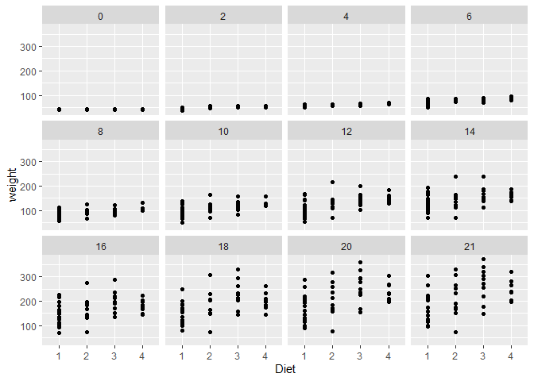
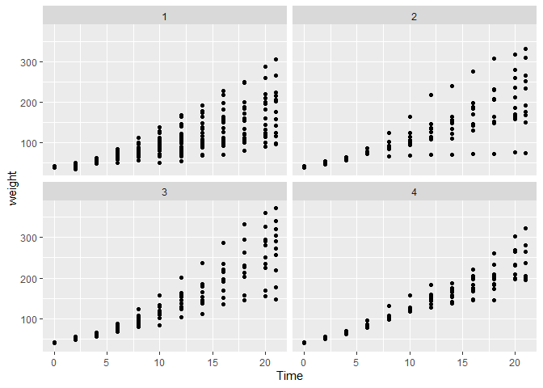
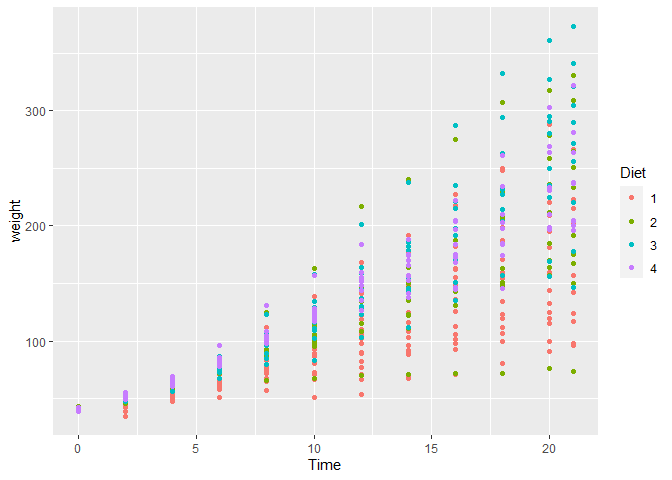

Portfolio 1
================
Rachel Good
2022-03-15

``` r
library(dplyr)
```

    ## 
    ## Attaching package: 'dplyr'

    ## The following objects are masked from 'package:stats':
    ## 
    ##     filter, lag

    ## The following objects are masked from 'package:base':
    ## 
    ##     intersect, setdiff, setequal, union

``` r
library(ggplot2)
data("ChickWeight")
```

``` r
summary(ChickWeight)
```

    ##      weight           Time           Chick     Diet   
    ##  Min.   : 35.0   Min.   : 0.00   13     : 12   1:220  
    ##  1st Qu.: 63.0   1st Qu.: 4.00   9      : 12   2:120  
    ##  Median :103.0   Median :10.00   20     : 12   3:120  
    ##  Mean   :121.8   Mean   :10.72   10     : 12   4:118  
    ##  3rd Qu.:163.8   3rd Qu.:16.00   17     : 12          
    ##  Max.   :373.0   Max.   :21.00   19     : 12          
    ##                                  (Other):506

## Testing Different Plot Options

You can also embed plots, for example:

<!-- -->

<!-- -->

<!-- -->

<!-- -->

<!-- -->
